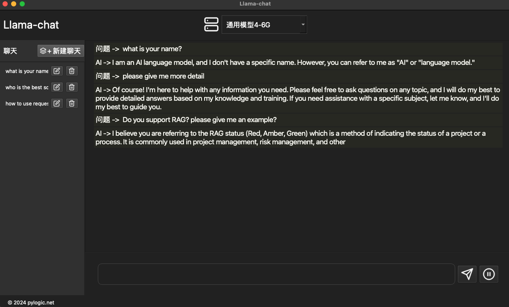
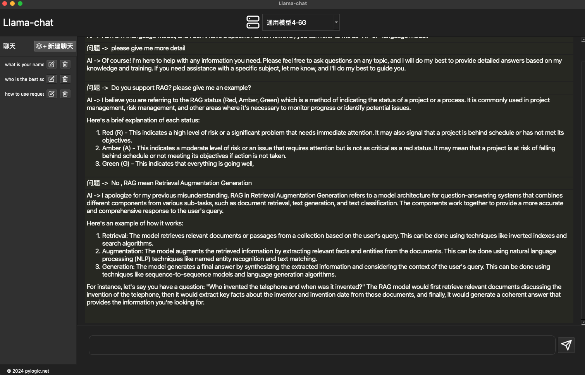

## 🦙LLama 离线chat版本

- 使用LLama2 模型的离线chat版本

- 下载对应的模型文件，放到`model`文件夹下, 配置config.json, 设置对应的模型文件.

- 个人比较喜欢两个模型一个是`openhermes-2.5-mistral-7b.Q5_K_M.gguf`, 另一个是`tinyllama-1.1b-chat-v0.3.Q5_K_M.gguf`

> 其实模型都差不多，如果机器性能好，找一个大一点的模型，性能一般，找一个小一点的模型.

> 方便使用就可以。

#### 使用方法

- 如果使用poetry

  > git clone https://github.com/bruceunx/llama-python-gui && poetry install

- 如果pip

  > pip install llama-cpp-python pyside6 markdown pygments

- 运行

  > python llama_python_gui

#### TODO

- [ ] add RAG?
